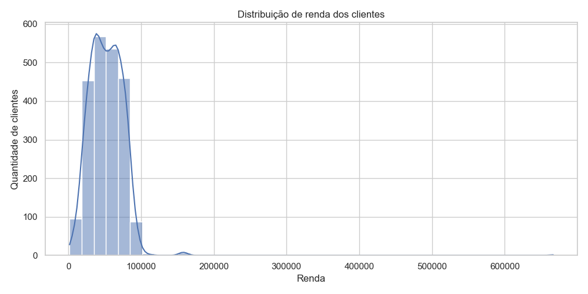
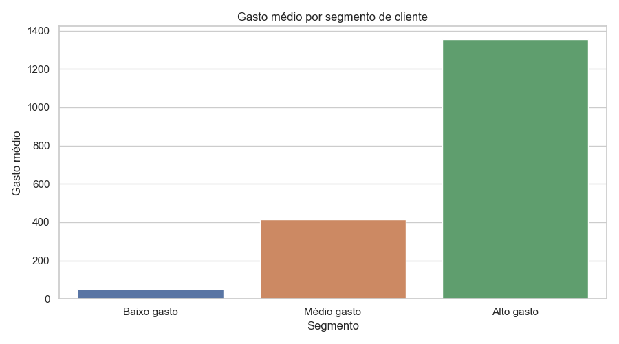

# Análise exploratória de clientes com Python

Este projeto é uma análise exploratória de uma base de clientes. A ideia foi entender o perfil dos clientes, padrões de consumo e diferenças entre grupos de gasto.

Usei Python para limpar os dados, criar variáveis, analisar correlações e gerar visualizações simples para apoiar uma leitura de negócio.

## Perguntas analisadas

- Qual é o perfil geral dos clientes?
- Como renda e gasto total se relacionam?
- Clientes com mais filhos em casa têm comportamento diferente?
- Quais grupos apresentam maior gasto médio?
- Como uma segmentação simples pode ajudar em ações de marketing ou retenção?

## Ferramentas usadas

- Python
- pandas
- numpy
- matplotlib
- seaborn
- Jupyter Notebook

## Etapas do projeto

1. Carregamento da base
2. Checagem inicial dos dados
3. Tratamento de valores ausentes
4. Criação de variáveis como idade, gasto total e total de compras
5. Análise exploratória
6. Visualização dos dados
7. Segmentação simples de clientes por gasto
8. Registro dos principais insights

## Principais achados

- A coluna `Income` tinha 24 valores ausentes. Como era uma quantidade pequena em relação ao total da base, essas linhas foram removidas.
- A renda tem correlação positiva com o gasto total dos clientes.
- Clientes com maior renda também tendem a realizar mais compras.
- Clientes com mais filhos em casa apresentaram, em média, menor gasto total.
- O grupo de alto gasto teve renda média maior, menor média de filhos e maior número médio de compras.

## Segmentação dos clientes

A segmentação foi feita com base no gasto total dos clientes, dividindo a base em três grupos:

| Segmento | Clientes | Renda média | Média de filhos | Gasto médio | Compras médias |
|---|---:|---:|---:|---:|---:|
| Baixo gasto | 738 | 32.724 | 1,28 | 51,35 | 4,71 |
| Médio gasto | 737 | 50.950 | 1,11 | 414,76 | 13,06 |
| Alto gasto | 738 | 73.034 | 0,45 | 1.354,70 | 19,93 |

## Exemplos de gráficos

### Distribuição de renda



### Gasto médio por segmento



## Estrutura do projeto

```text
customer-eda-python/
├── data/
│   ├── raw/
│   └── processed/
├── notebooks/
│   └── 01_customer_eda.ipynb
├── outputs/
│   ├── charts/
│   └── tables/
├── reports/
│   └── executive_summary.md
├── requirements.txt
└── README.md